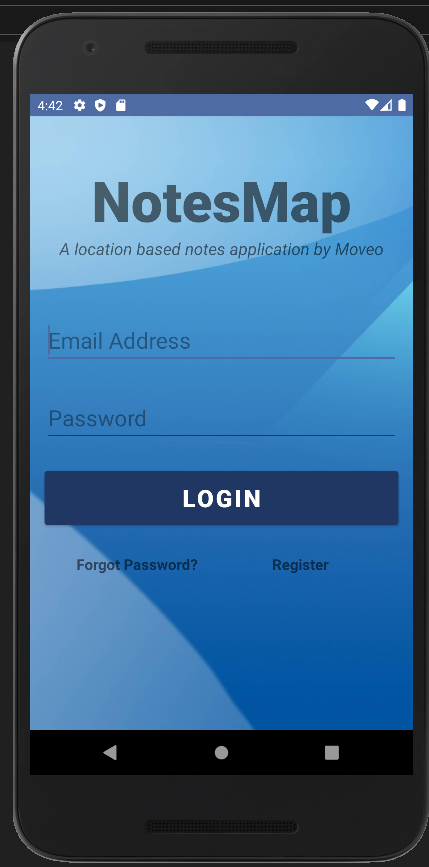
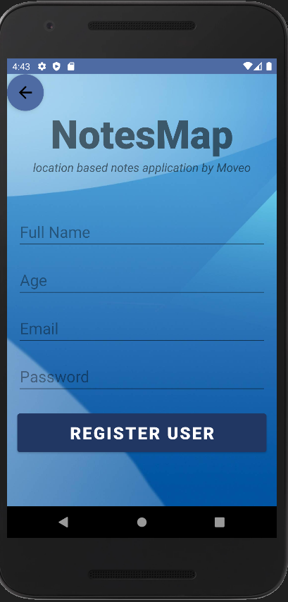
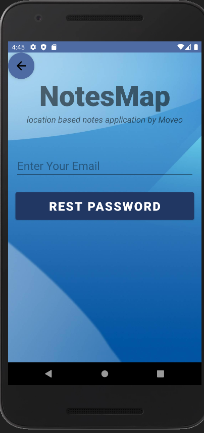
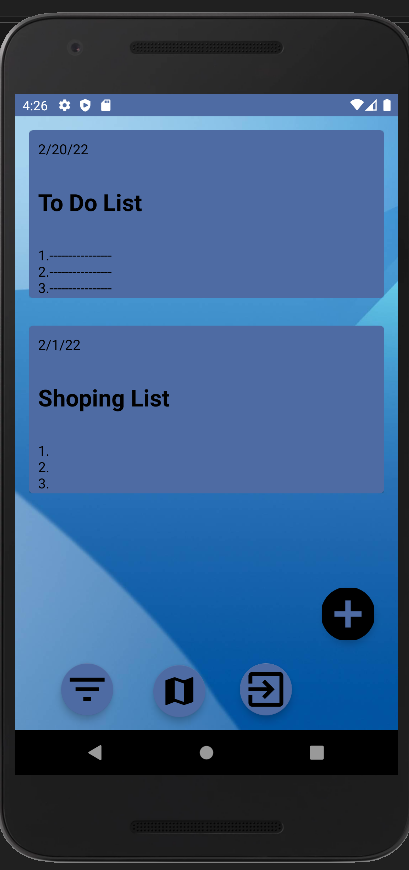
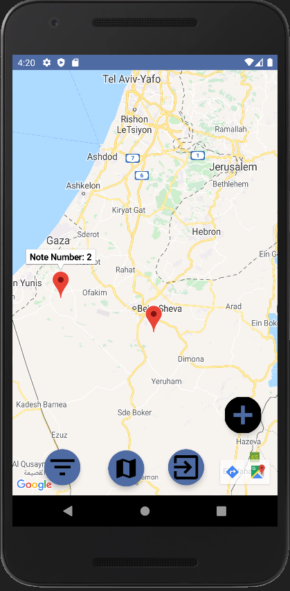
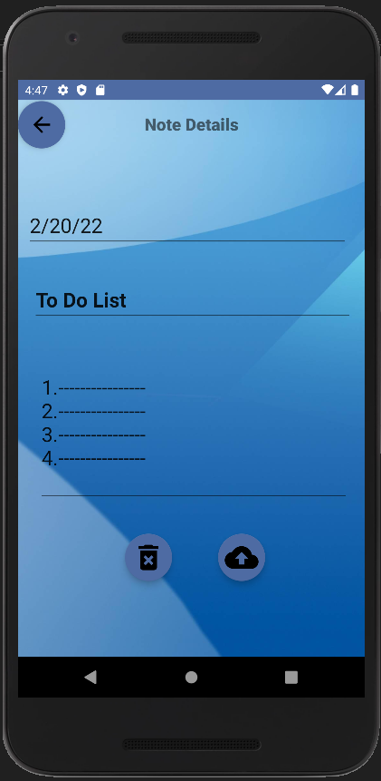

# Moveo-Notes Android Application 

<br />
<p align="center">
      
  </a>
</p>
<p align="center">
	A Location based Notes Application.
</p>

## App Functionality

1. On the first page there is an option to Log In or Register or Forgot Password:
	- Authentication and validation inputs of the users when entering the app using FireBase SDK.
	- Once the user has registered, the next time he wants to log in he will be able to log in automatically via login.
	- Bonus : f you are registered and have forgotten your password, you must write the email and you will receive a password recovery email.
2. Data is saved in FireBase FireStore DB.
3. Implementation of Note:
	- Each Note can have a title, body, date and location.
4. Implementation of GoogleMaps:
	- For each Note, Map shows a marker at the note location.

Bugs : Sometimes the markers do not appear on the map and sometimes they do.

## Getting Started...

#### Installation
- Export git repository to Android Studio
```bash
https://github.com/GiladAmar1/Moveo-Task.git
```
- Build and run the application on an Android emulator

## Screenshots

Login Page            | Register Page            |  Forgot Password Page
:-------------------------:|:-------------------------:|:-------------------------:
  |   |  

List Mode            |  Map Mode |  Note Screen
:-------------------------:|:-------------------------: |:-------------------------:
  |   |  

	
## Developed by:
* [**Gilad Amar**](https://github.com/GiladAmar1/)
